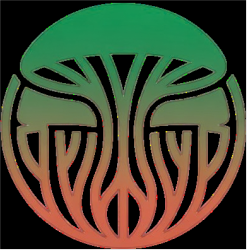

<p align="center">
  
</p>

<h1 align="center">MycoRegen</h1>

<p align="center">
  <strong>Marketplace de micorremediacion de suelos con transparencia blockchain en Chile</strong>
</p>

<p align="center">
  <a href="https://mycoregen.vercel.app">Demo en Vivo</a> ·
  <a href="#como-funciona">Como Funciona</a> ·
  <a href="#stack-tecnologico">Stack Tecnologico</a> ·
  <a href="#estructura-del-proyecto">Estructura</a>
</p>

<p align="center">
  
  
  
  
  
</p>

---

## Acerca del Proyecto

Chile cuenta con mas de **1.300 sitios contaminados** — muchos cercanos a comunidades expuestas a arsenico, plomo, cobre y mercurio. Las empresas obligadas legalmente a remediar enfrentan procesos burocraticos lentos, contratistas opacos y ninguna forma confiable de verificar que el trabajo realmente se realizo.

**MycoRegen** resuelve esto conectando a empresas que deben remediar suelos contaminados con proveedores especializados en **biorremediacion con hongos (micorremediacion)**. La plataforma utiliza la **blockchain de Stellar** como capa de confianza: los presupuestos se bloquean en contratos inteligentes de escrow, los pagos se liberan solo tras triple verificacion, y toda la evidencia queda registrada permanentemente on-chain.

---

## Por que Hongos

La micorremediacion utiliza especies fungicas para degradar o absorber contaminantes del suelo. Frente a metodos quimicos tradicionales:

| | Micorremediacion | Remediacion Quimica |
|---|---|---|
| **Costo** | 3–10x mas barato | Costoso |
| **Metodo** | No invasivo, in-situ | Requiere excavacion |
| **Resultado** | Regenera la estructura del suelo | Limpia pero degrada |
| **Empleo** | Cultivo local | Quimicos importados |

Las especies utilizadas en la plataforma incluyen:

- ***Pleurotus ostreatus*** — Degrada hidrocarburos, absorbe plomo y cadmio
- ***Trametes versicolor*** — Descompone toxinas organicas y PCBs
- ***Aspergillus niger*** — Biosorcion de cobre y cadmio en suelos mineros

---

## Por que Stellar

| Caracteristica | Stellar | Ethereum |
|---|---|---|
| Costo por transaccion | **$0.00001** | $2–50 |
| Tiempo de confirmacion | **3–5 segundos** | Minutos |
| Contratos inteligentes | Soroban | Solidity |
| Stablecoin | USDC (nativo) | USDC (ERC-20) |

Stellar permite pagos por hito que serian impracticables en redes de alto costo. Cada deposito en escrow, liberacion de fondos y registro de evidencia cuesta una fraccion de centavo.

---

## Como Funciona

```
1. DEPOSITO           2. EJECUCION          3. VERIFICACION       4. LIBERACION
┌─────────────┐      ┌─────────────┐      ┌─────────────┐      ┌─────────────┐
│  La empresa  │      │  Proveedor  │      │  Triple     │      │  Soroban    │
│  deposita    │ ──>  │  realiza    │ ──>  │  verificac: │ ──>  │  libera     │
│  presupuesto │      │  tratamiento│      │  - Lab      │      │  USDC al    │
│  en Soroban  │      │  fungico    │      │  - GPS      │      │  proveedor  │
│  escrow      │      │  en terreno │      │  - Comunidad│      │             │
└─────────────┘      └─────────────┘      └─────────────┘      └─────────────┘
```

1. **Deposito en escrow** — La empresa bloquea el presupuesto de remediacion en un contrato inteligente Soroban. Ni la empresa, ni el proveedor, ni la plataforma pueden retirar fondos unilateralmente.

2. **Ejecucion de la remediacion** — Universidades, cooperativas o laboratorios especializados realizan el tratamiento fungico en hitos medibles.

3. **Triple verificacion** — Cada hito requiere tres validaciones independientes antes de liberar fondos:
   - **Laboratorio**: Analisis certificado de suelo confirmando reduccion de contaminantes
   - **Geolocalizacion**: Evidencia fotografica con GPS del sitio
   - **Comunidad**: Vecinos confirman que el trabajo se esta realizando en su zona

4. **Liberacion automatica** — Una vez aprobadas las tres verificaciones, el contrato inteligente libera el pago al proveedor. Toda transaccion queda registrada permanentemente en Stellar.

---

## Roles de la Plataforma

### Para Empresas (el que paga)
Dashboard con proyectos activos, monitoreo de escrow y pruebas de cumplimiento regulatorio. Las empresas pueden rastrear cada USDC gastado y verificar hitos en tiempo real.

### Para Proveedores (el que ejecuta)
Marketplace para explorar proyectos disponibles, enviar propuestas y recibir pagos automaticos por hito verificado. Soporta universidades, cooperativas y laboratorios ambientales.

### Para Comunidades (el que vigila)
Mapa interactivo de zonas de remediacion con progreso en tiempo real. Los vecinos pueden ver evidencia, seguir hitos y validar que los contratistas estan presentes y trabajando en su zona.

---

## Funcionalidades Principales

- **Escrow en contrato inteligente** — Fondos asegurados en Soroban, liberados solo tras verificacion completada
- **Triple verificacion** — Laboratorio + Geolocalizacion + Comunidad por cada hito
- **Pagos en USDC** — Estables, internacionales, sin intermediarios bancarios
- **Mapa interactivo** — Visualizacion con Leaflet de todas las zonas monitoreadas en Chile
- **Evidencia en blockchain** — Fotos, resultados de lab y documentos hasheados y registrados en Stellar
- **Dashboards multi-rol** — Vistas personalizadas para empresas, proveedores y comunidades
- **Seguimiento de hitos** — Timeline visual con barras de progreso, badges de estado e historial de transacciones
- **Diseno responsivo** — Soporte completo para movil y escritorio

---

## Stack Tecnologico

| Capa | Tecnologia |
|---|---|
| Framework | [Next.js 16](https://nextjs.org/) (App Router) |
| UI | [React 19](https://react.dev/), [Tailwind CSS 4](https://tailwindcss.com/) |
| Iconos | [Lucide React](https://lucide.dev/) |
| Mapas | [Leaflet](https://leafletjs.com/) + [React Leaflet](https://react-leaflet.js.org/) |
| Blockchain | [Stellar](https://stellar.org/) / [Soroban](https://soroban.stellar.org/) |
| Pagos | USDC en Stellar |
| Deploy | [Vercel](https://vercel.com/) |
| Lenguaje | TypeScript |

---

## Estructura del Proyecto

```
mycoregenera/
├── src/
│   ├── app/                    # Paginas (Next.js App Router)
│   │   ├── page.tsx            # Landing page
│   │   ├── mapa/               # Mapa interactivo de remediacion
│   │   ├── empresa/            # Dashboard empresa
│   │   ├── proveedor/          # Dashboard proveedor
│   │   ├── comunidad/          # Vista comunidad
│   │   └── proyecto/[id]/      # Detalle de proyecto con hitos
│   ├── components/
│   │   ├── landing/            # Hero, HowItWorks, WhyStellar, WhyFungi
│   │   ├── layout/             # Navbar
│   │   ├── map/                # ChileMap, MapSidebar
│   │   ├── project/            # EscrowCard, MilestoneTimeline, TransactionHistory
│   │   ├── stellar/            # WalletAddress, USDCAmount, EscrowMeter, StellarBadge
│   │   ├── dashboard/          # StatCard
│   │   └── ui/                 # Card, Badge, Button, ProgressBar
│   ├── data/                   # Datos mock (zonas, empresas, proveedores, proyectos)
│   ├── lib/                    # Funciones utilitarias
│   └── types/                  # Definiciones de tipos TypeScript
└── public/                     # Activos estaticos
```

---

## Instalacion

### Requisitos previos

- Node.js 18+
- npm, yarn, pnpm o bun

### Clonar e instalar

```bash
git clone https://github.com/Micoh18/mycoregenera.git
cd mycoregenera/mycoregenera
npm install
```

### Desarrollo

```bash
npm run dev
```

Abrir [http://localhost:3000](http://localhost:3000) en el navegador.

### Build de produccion

```bash
npm run build
npm start
```

---

## Deploy

La plataforma esta desplegada en Vercel con el directorio raiz configurado en `/mycoregenera`.

**En vivo**: [mycoregen.vercel.app](https://mycoregen.vercel.app)

---

## Referencias

- [Micorremediacion — Wikipedia](https://en.wikipedia.org/wiki/Mycoremediation)
- [Red Stellar](https://stellar.org/)
- [Contratos Inteligentes Soroban](https://soroban.stellar.org/)
- [USDC en Stellar](https://www.circle.com/usdc/stellar)
- [SERNAGEOMIN — Servicio Nacional de Geologia y Mineria](https://www.sernageomin.cl/)
- [SMA — Superintendencia del Medio Ambiente](https://www.sma.gob.cl/)
- Singh, H. (2006). *Mycoremediation: Fungal Bioremediation*. Wiley.
- Stamets, P. (2005). *Mycelium Running: How Mushrooms Can Help Save the World*. Ten Speed Press.

---

## Licencia

Proyecto construido para el [Stellar Community Fund](https://communityfund.stellar.org/).

---

<p align="center">
  Construido con Stellar · Impulsado por Hongos
</p>
